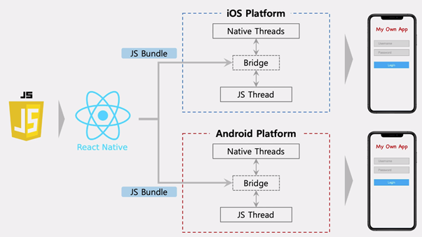
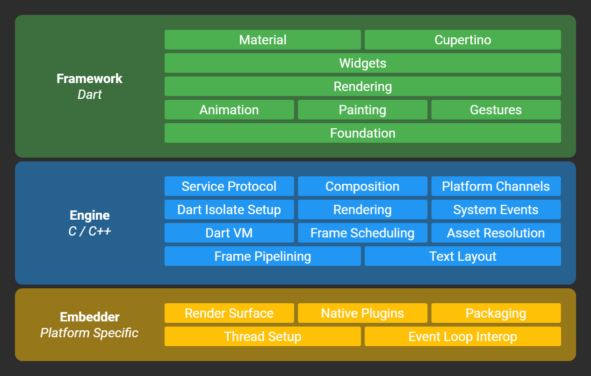

  모바일 웹 개발을 하기 위해서는 안드로이드와 iOS, 두 가지 운영체제를 고려해서 만들어야 한다. 안드로이드는 Java, iOS는 Swift로 서로 다른 언어를 호환하기 때문이다.
  이로 인해 개발자들은 서로 독립적인 두 가지 애플리케이션을 개발해야 하고 유지보수 과정에서도 중복 작업을 해야하는데, 이러 개발 방식을 네이티브라고 한다. 
  이러한 효율성 문제를 극복하기 위해 개발자들은 하나의 언어로도 안드로이드와 iOS에서 개발과 관리를 할 수 있는 크로스 플랫폼 프레임워크를 활용하는데,
  리액트 네이티브와 플러터가 가장 많이 사용하는 크로스 플랫폼이다.

 

** Native

- 장점:  성능 1000% 활용, 완전한 기능 접근성
- 단점:  효율성 부족(개발 및 유지보수)

| 운영체제 | 개발 과정 |
| :-----: | ----- |
| iOS | 디자인(인터페이스, 색상 등) -> 개발(언어: Swift/objective-C, 환경: Xcode) -> 테스트 -> 디버깅 및 최적화 -> 배포 |
| 안드로이드 | 디자인(인터페이스, 색상 등) -> 개발(언어: Java/Kotlin, 환경: 안드로이드 스튜디오) -> 테스트 -> 디버깅 및 최적화 -> 배포 |

 
1. RN(React Native)

- 장점:  크로스 플랫폼 개발, 재배포 필요x, 발달된 커뮤니티 규모
- 단점:  성능 한계

 
2. Flutter

- 장점:  크로스 플랫폼 개발, 뛰어난 성능
- 단점:  작은 커뮤니티 규모

